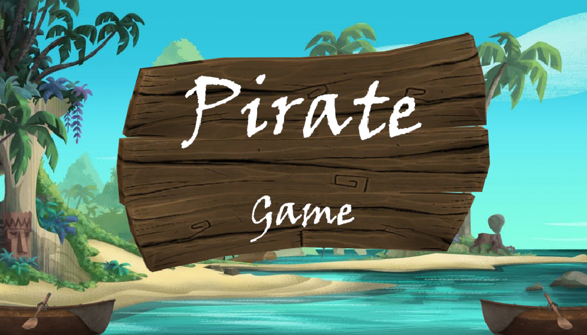
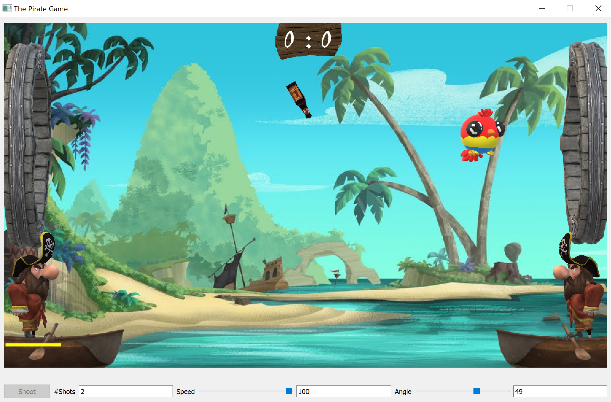
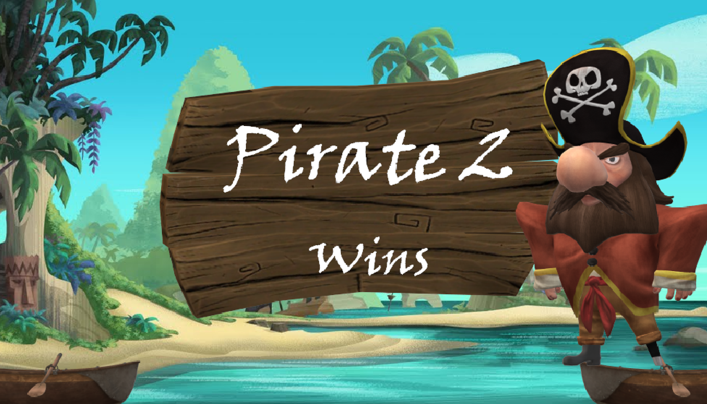

# Pirate Game

Simples Spiel, welches im Rahmen eines Kurzprojekts an der hf-ict mit Qt entwickelt wurde.

## Installation

ZIP-Datei von https://github.com/khazeamo/hfict-gui-game/releases herunterladen und an einen beliebigen Ort entpacken.
Das Spiel kann anschliessend über die EXE gestartet werden.

## Spielidee
Die beiden Spieler werfen abwechslungsweise mit Flaschen und versuchen den Papageien-Ballon so zu treffen,
dass dieser sich ins Tor des Gegenspielers bewegt.

Das Spiel endet, wenn ein Spieler 2 Tore erzielt hat.

## Steuerung
Das Spiel kann über den Button `Start` gestartet werden.

### Aktiver Spieler
Es wird per Zufall entschieden, welcher Spieler den ersten Wurf machen darf.
Der aktive Spieler wird durch einen gelben Balken unterhalb des Spielers gekennzeichnet.
Nach jedem Wurf wechselt der Spieler automatisch, wobei die Wurfeinstellungen gespeichert und beim nächsten Wurf des
Spielers wieder geladen werden.

### Werfen
Würfe können über die Geschwindigkeit (Schieberegler `Speed`) und den Winkel (Schieberegler `Angle`) variiert werden.
Die Schieberegler können per Maus oder über folgende Tasten gesteuert werden:

Taste | Steuerung
----- | -------------------------
&uarr;|Winkel vergrössern
&darr;|Winkel verkleinern
&rarr;|Geschwindigkeit erhöhen
&larr;|Geschwindigkeit reduzieren

Über den Button `Shoot` wird der Wurf ausgelöst.
